# Case Study: Enterprise QMS Platform with GenAI Integration

> **Interview Discussion Guide** — A real-world system you designed and built

---

## Executive Summary

Built a **modular, multi-tenant Quality Management System (QMS)** for manufacturing environments, integrating **GenAI capabilities** across the platform. The system handles audit management, non-conformance tracking, and corrective actions with AI-assisted workflows that reduce manual effort by 60%+ and improve defect detection accuracy.

---

## 1. Comprehensive Platform Architecture

### Full System Architecture Diagram


### Data Flow: AI-Assisted NCM Creation

```mermaid
sequenceDiagram
    autonumber
    participant User as 📱 Mobile User
    participant API as 🔐 API Gateway
    participant File as 📁 File Service
    participant S3 as ☁️ S3 Storage
    participant AI as 🧠 AI Layer
    participant NCM as 📋 NCM Service
    participant DB as 🐘 PostgreSQL
    participant Vec as 🔍 Vector DB

    User->>API: Capture photo + voice note
    API->>File: Upload evidence
    File->>S3: Store files
    S3-->>File: Return URLs
    
    File->>AI: Analyze with GPT-4V + Whisper
    
    par Image Analysis
        AI->>AI: GPT-4V: Detect defect type, severity
    and Audio Transcription
        AI->>AI: Whisper: Transcribe voice description
    end
    
    AI-->>File: Return structured extraction
    
    File->>NCM: Create NCM with AI-prefilled data
    NCM->>DB: Save NCM record
    
    NCM->>AI: Generate embedding for RAG
    AI->>Vec: Store embedding
    
    Vec->>Vec: Find similar past NCMs
    Vec-->>NCM: Return similar NCMs
    
    NCM-->>API: NCM created + similar records
    API-->>User: ✅ NCM ready with suggestions
```



### Component Interaction Overview

```mermaid
flowchart LR
    subgraph Frontend
        WEB[🌐 Web App]
        MOB[📱 Mobile App]
    end

    subgraph Backend
        API[API Gateway]
        CORE[Core Platform]
        MOD[Business Modules]
    end

    subgraph AI_Services["AI Services"]
        RAG[RAG Engine]
        VIS[GPT-4 Vision]
        WHI[Whisper]
        GEN[LLM Generator]
    end

    subgraph Storage
        PG[(PostgreSQL)]
        VEC[(pgvector)]
        S3[(S3)]
        RED[(Redis)]
    end

    WEB & MOB --> API
    API --> CORE
    CORE --> MOD
    MOD --> RAG & VIS & WHI & GEN
    RAG --> VEC
    VIS & WHI --> S3
    GEN --> PG
    MOD --> PG & S3 & RED

    style Frontend fill:#bbdefb
    style Backend fill:#c8e6c9
    style AI_Services fill:#fff9c4
    style Storage fill:#ffcdd2
```



### Architecture Decision Records (ADRs)

| Decision | Options Considered | Choice | Rationale |
|----------|-------------------|--------|-----------|
| **Database** | PostgreSQL vs MongoDB | PostgreSQL + pgvector | ACID for compliance, pgvector for embeddings in same transaction |
| **AI Provider** | OpenAI vs Azure OpenAI vs Anthropic | OpenAI (with Azure failover) | Best multimodal (GPT-4V), Whisper integration |
| **Search** | Elasticsearch vs pgvector | Hybrid (pgvector + pg_trgm) | Reduced ops overhead, ACID with transactional data |
| **Architecture** | Microservices vs Modular Monolith | Modular Monolith | Faster iteration, team size, clear module boundaries |
| **Mobile** | Native vs Cross-platform | React Native | Shared logic with web, access to device APIs |

---

## 2. Module-Level Architecture

### Core Platform Design Philosophy

```mermaid
flowchart TB
    subgraph CORE["⚙️ CORE PLATFORM LAYER"]
        AUTH["🔐 Authentication\nJWT + OAuth"]
        RBAC["🛡️ RBAC"]
        TENANT["🏢 Multi-Tenancy\nOrg → Site"]
        FILES["📁 File Management"]
        APIGW["🌐 API Gateway"]
    end

    CORE --> MODULES

    subgraph MODULES["📦 BUSINESS MODULES"]
        direction LR
        subgraph AUDIT["Audit"]
            A1["Scheduling"]
            A2["Execution"]
            A3["Checklists"]
            A4["🤖 AI Generate"]
        end
        subgraph NCM["NCM"]
            N1["Detection"]
            N2["Classification"]
            N3["Evidence"]
            N4["🤖 AI Creation"]
        end
        subgraph CAPA["CAPA"]
            C1["Root Cause"]
            C2["Action Plans"]
            C3["Verification"]
        end
        subgraph INTEL["Intelligence"]
            I1["Analytics"]
            I2["Dashboards"]
            I3["Trends"]
            I4["🔍 RAG Search"]
        end
    end

    style CORE fill:#e8eaf6
    style MODULES fill:#e8f5e9
```



### Key Architectural Decisions

| Decision | Rationale |
|----------|-----------|
| **Modular monolith** | Faster iteration than microservices, clear module boundaries, shared database with schema isolation |
| **Multi-tenancy at org/site level** | Manufacturing plants operate as sites under organizations; data isolation is critical for compliance |
| **RBAC with permission-based access** | Auditors, supervisors, quality managers need different access levels |
| **Lazy module initialization** | Prevents blocking during startup; discovered via pytest hanging issue |

### Tech Stack

- **Backend**: FastAPI, SQLAlchemy, Alembic, PostgreSQL
- **Frontend**: React, Redux Toolkit, TypeScript
- **GenAI**: OpenAI GPT-4V, Whisper, Embeddings API, Vector DB (pgvector)
- **Infrastructure**: Containerized, cloud-agnostic

---

## 2. GenAI Feature #1: RAG-Based Similarity Search

### Problem Statement
Quality engineers waste 2-3 hours daily searching for similar past NCMs, related audits, and historical corrective actions. Keyword search fails because the same defect can be described in dozens of ways.

### Solution Architecture



```mermaid
flowchart LR
    A["🔍 User Query\n'weld crack on frame'"] --> B["🧮 Embedding Model\ntext-embedding-3-small"]
    B --> C["📊 Vector Search\npgvector + cosine sim"]
    C --> D["Top 20 Candidates"]
    D --> E["🤖 LLM Reranking\n+ Context Synthesis"]
    E --> F["✅ Ranked Results\nwith Summaries"]

    style A fill:#e3f2fd
    style B fill:#fff3e0
    style C fill:#f3e5f5
    style E fill:#fff8e1
    style F fill:#e8f5e9
```

### Implementation Details

| Component | Details |
|-----------|---------|
| **Document Chunking** | 512 tokens with 50 token overlap; preserves context across NCM descriptions |
| **Embedding Strategy** | Embed: NCM title + description + root cause + corrective action |
| **Hybrid Search** | Vector similarity (0.7 weight) + BM25 keyword (0.3 weight) |
| **Metadata Filtering** | Pre-filter by org_id, site_id, date range before vector search |

### Interview Talking Points

> "We chose pgvector over dedicated vector DBs like Pinecone because our similarity search is tightly coupled with transactional data. When an NCM is updated, we need ACID guarantees on both the record and its embedding within the same transaction."

> "The hybrid search approach was crucial. Pure semantic search missed exact part numbers and defect codes. Pure keyword missed semantically similar issues described differently. The 70/30 blend gave us 94% relevance in user studies."

---

## 3. GenAI Feature #2: Multimodal NCM Creation

### Problem Statement
Shop floor workers capture photos/videos of defects but struggle to create structured NCM records. Result: incomplete data, delayed reporting, inconsistent categorization.

### Solution: AI-Assisted NCM Creation

```mermaid
flowchart TB
    subgraph INPUT["📥 MULTIMODAL INPUT"]
        IMG["📷 Image\nDefect Photo"]
        VID["🎥 Video\nProcess Clip"]
        AUD["🎤 Audio\nVoice Description"]
    end

    subgraph PROCESS["🤖 AI PROCESSING"]
        GPT4V["👁️ GPT-4 Vision\nImage Analysis"]
        FRAME["🎞️ Frame Extract\n+ GPT-4V"]
        WHISPER["🗣️ Whisper\nTranscription"]
    end

    subgraph OUTPUT["📋 STRUCTURED OUTPUT"]
        FUSION["🔀 Fusion & Extraction"]
        NCM["📝 Pre-filled NCM Form\n• Defect Type\n• Severity\n• Affected Part\n• Location\n• Category"]
    end

    IMG --> GPT4V
    VID --> FRAME
    AUD --> WHISPER
    GPT4V --> FUSION
    FRAME --> FUSION
    WHISPER --> FUSION
    FUSION --> NCM

    style INPUT fill:#e3f2fd
    style PROCESS fill:#fff8e1
    style OUTPUT fill:#e8f5e9
```



### Prompt Engineering for Defect Analysis

```python
DEFECT_ANALYSIS_PROMPT = """
Analyze this manufacturing defect image and extract:

1. DEFECT_TYPE: (crack, scratch, deformation, contamination, 
                 dimensional, surface, assembly, other)
2. SEVERITY: (critical, major, minor) based on:
   - Critical: Safety risk or complete functional failure
   - Major: Significant quality impact, likely rejection
   - Minor: Cosmetic or within tolerance
3. LOCATION: Describe where on the part the defect appears
4. ROOT_CAUSE_HYPOTHESIS: Most likely cause (tooling, material, 
                          process, handling)
5. CONFIDENCE: Your confidence level (high/medium/low)

Output as JSON. If image quality prevents analysis, set 
confidence to "low" and explain in a "notes" field.
"""
```

### Evidence Capture Integration

| Evidence Type | Processing | Storage |
|---------------|------------|---------|
| **Photo** | GPT-4V analysis → structured extraction | S3 + DB reference |
| **Video** | Keyframe extraction → multi-frame analysis | S3 + DB reference |
| **Voice Note** | Whisper transcription → NER extraction | S3 + transcript in DB |
| **Signature** | Canvas capture → timestamped PNG | S3 + DB reference |

### Interview Talking Points

> "We faced a cold-start problem — GPT-4V doesn't know our specific defect taxonomy. We solved this with few-shot prompting using 15 canonical examples per defect category, stored as a prompt library that quality managers can update."

> "Video analysis was tricky. A 30-second clip might have the defect visible in only 2 seconds. We extract frames at 2fps, run GPT-4V on each, then use an LLM to synthesize findings and identify the most informative frames."

---

## 4. GenAI Feature #3: AI-Powered Checklist Generation

### Problem Statement
Creating audit checklists is tedious. Quality managers copy from templates, miss context-specific items, and checklists become stale as standards evolve.

### Solution Architecture



```mermaid
flowchart TB
    subgraph CONTEXT["📋 INPUT CONTEXT"]
        TYPE["Audit Type\nInternal, Supplier, Process"]
        STD["Standards\nISO 9001, IATF 16949"]
        HIST["Historical Data\nPast findings, NCM trends"]
    end

    CONTEXT --> RAG

    RAG["📚 RAG: Retrieve\nRelevant Sections\nfrom Standards DB"]

    RAG --> LLM

    LLM["🤖 LLM Generation\n• Sections\n• Items\n• Evidence Types\n• Scoring Criteria"]

    LLM --> REVIEW

    REVIEW["👤 Human Review UI\nEdit → Approve → Save as Template"]

    style CONTEXT fill:#e3f2fd
    style RAG fill:#f3e5f5
    style LLM fill:#fff8e1
    style REVIEW fill:#e8f5e9
```

### Flow Checklist Builder

Built a visual **Flow Checklist Builder** with:
- Drag-and-drop section/item organization
- Conditional logic (show item X if item Y = "Non-Compliant")
- Multiple response types (yes/no, scale, text, evidence capture)
- Full-screen modal UX for focused editing

### Interview Talking Points

> "The key insight was that AI shouldn't replace the auditor's judgment — it should accelerate their prep work. We generate a draft checklist, but the auditor always reviews and customizes before execution."

> "We store generated checklists as templates so organizations build a library over time. The AI learns from saved templates to improve future suggestions for that org."

---

## 5. Multi-Tenancy & RBAC Design

### Tenancy Model

```mermaid
flowchart TB
    ORG["🏢 Organization\nAcme Corp"] --> DETROIT["🏭 Site: Detroit Plant"]
    ORG --> MEXICO["🏭 Site: Mexico Plant"]
    
    DETROIT --> D1["Assembly"]
    DETROIT --> D2["Quality"]
    DETROIT --> D3["Warehouse"]
    
    MEXICO --> M1["Assembly"]
    MEXICO --> M2["Shipping"]

    style ORG fill:#e8eaf6
    style DETROIT fill:#e3f2fd
    style MEXICO fill:#e3f2fd
```



### RBAC Implementation

```python
class AuditPermissions:
    VIEW = "audit:view"
    CREATE = "audit:create"
    EXECUTE = "audit:execute"
    SUBMIT = "audit:submit"
    APPROVE = "audit:approve"

# Applied via dependency injection
@router.post("/audits")
async def create_audit(
    audit: AuditCreate,
    _: None = Depends(require_permission(AuditPermissions.CREATE)),
    current_user: User = Depends(get_current_user)
):
    ...
```

### Key Design Decision: Permission vs. Ownership

| Scenario | Solution |
|----------|----------|
| Auditor assigned to an audit | Can execute without global `audit:execute` permission |
| Quality Manager | Has `audit:approve` for their site only |
| Superuser | Bypasses permission checks for admin operations |

---

## 6. Challenges & Lessons Learned

### Challenge 1: Pytest Hanging on Collection

**Problem**: Tests hung during collection because database connections were initialized at import time.

**Solution**: Implemented lazy initialization pattern — database engine created only when first query runs.

**Lesson**: In modular systems, module initialization order matters. Document and enforce lazy loading patterns.

### Challenge 2: Alembic Migration Conflicts

**Problem**: Multiple developers created migrations simultaneously, causing "multiple heads" errors.

**Solution**: CI check that fails if multiple heads exist; merge migrations before PR approval.

### Challenge 3: GPT-4V Hallucinations on Defect Severity

**Problem**: Model sometimes marked minor scratches as "critical" defects.

**Solution**: 
- Added calibration examples in prompt
- Implemented confidence thresholds (low confidence → flag for human review)
- Built feedback loop where corrections update the prompt library

---

## 7. Metrics & Impact

| Metric | Before | After | Improvement |
|--------|--------|-------|-------------|
| NCM creation time | 15 min | 4 min | **73% reduction** |
| Checklist prep time | 2 hours | 20 min | **83% reduction** |
| Similar NCM search | 45 min | 2 min | **96% reduction** |
| Defect categorization accuracy | 78% | 94% | **16% improvement** |

---

## 8. Future Roadmap (Discussion Points)

1. **Predictive Quality**: Use NCM trends + process data to predict defects before they occur
2. **Automated CAPA Suggestions**: Given an NCM, suggest corrective actions based on historical effectiveness
3. **Voice-Driven Audit Execution**: Hands-free audit execution for environments where touch screens aren't practical
4. **Cross-Org Benchmarking**: Anonymized comparison of quality metrics across organizations (with consent)

---

## 9. Interview Q&A Prep

### "Walk me through a technical decision you're proud of."

> "Our hybrid RAG search. We started with pure vector search but users complained about missing exact matches on part numbers. Rather than abandoning semantic search, we implemented a hybrid approach with weighted scoring. The key was making the weights configurable per org — some orgs have very structured part numbers (keyword-heavy), others have free-form descriptions (semantic-heavy)."

### "How did you handle AI reliability in production?"

> "Three layers: (1) Confidence scores on every AI output — low confidence triggers human review, (2) Feedback capture — users can correct AI suggestions, which feeds back into prompt improvement, (3) Graceful degradation — if AI service is down, the system works fully manually with no data loss."

### "How did you approach multi-tenancy?"

> "We use a shared database with row-level security via org_id/site_id columns on every table. Every query goes through a tenant context that's set at authentication. The RBAC system checks permissions AND tenancy — you can't view an NCM unless you have permission AND belong to that org/site."

---

*Last Updated: January 2026*
