# GenAI Architecture Patterns Reference

## Pattern 1: Production RAG Architecture

### Overview
The foundation pattern for most enterprise GenAI applications. Retrieves relevant context from documents to ground LLM responses.


### Key Design Decisions

| Component | Options | Recommended |
|-----------|---------|-------------|
| **Vector DB** | Pinecone, Weaviate, Qdrant, pgvector | Pinecone (managed) / pgvector (simplicity) |
| **Embedding** | OpenAI, Cohere, E5, BGE | text-embedding-3-small (cost) / Cohere (quality) |
| **Reranker** | Cohere, CrossEncoder, ColBERT | Cohere Rerank (production) |
| **Chunking** | Fixed, Semantic, Recursive | Semantic with 512-token target |

### Scaling Considerations
- **Document ingestion**: Async pipeline with queue (Kafka/SQS)
- **Vector DB**: Sharding by tenant/collection
- **Query**: Semantic caching layer (Redis)
- **LLM calls**: Load balancing across endpoints

---

## Pattern 2: Multi-Model Orchestration

### Overview
Route requests to different models based on complexity, cost, or latency requirements.


### Router Implementation Approaches

| Approach | Pros | Cons |
|----------|------|------|
| **Keyword-based** | Fast, simple | Misses nuance |
| **Classifier** | Accurate, trainable | Needs labeled data |
| **LLM-as-router** | Most flexible | Adds latency/cost |
| **Embedding similarity** | Semantic matching | Needs examples per category |

### Use Cases
- Cost optimization (route 80% to cheap model)
- Latency-sensitive paths
- Specialized domain handling
- Fallback chains

---

## Pattern 3: Agentic System Architecture

### Overview
LLM-powered autonomous agents that can reason, plan, and use tools to accomplish complex tasks.

```mermaid
flowchart TB
    subgraph Core["🧠 Agent Core"]
        PL[Planner]
        EX[Executor]
        RF[Reflector]
    end
    
    subgraph Memory["💾 Memory System"]
        STM[Short-term<br/>Context Window]
        LTM[(Long-term<br/>Vector Store)]
        WM[Working<br/>Scratchpad]
    end
    
    subgraph Tools["🔧 Tool Registry"]
        T1[Search API]
        T2[Calculator]
        T3[Database]
        T4[Code Exec]
        T5[External APIs]
    end
    
    subgraph Guardrails["🛡️ Safety Layer"]
        VAL[Validator]
        FILT[Filter]
        AUDIT[Audit Log]
    end
    
    User[User Request] --> PL
    PL --> EX
    EX --> Tools
    Tools --> RF
    RF -->|Iterate| PL
    RF -->|Done| RESP[Response]
    
    Core <--> Memory
    EX --> Guardrails
```



### Agent Design Patterns

#### Supervisor Pattern
```
                    ┌─────────────┐
                    │  Supervisor │
                    │   Agent     │
                    └──────┬──────┘
                           │
          ┌────────────────┼────────────────┐
          ▼                ▼                ▼
    ┌──────────┐    ┌──────────┐    ┌──────────┐
    │ Research │    │  Writer  │    │ Reviewer │
    │  Agent   │    │  Agent   │    │  Agent   │
    └──────────┘    └──────────┘    └──────────┘
```

#### Pipeline Pattern
```
    Request → [Agent 1] → [Agent 2] → [Agent 3] → Response
                 │            │            │
              Extract      Process      Format
```

### Key Considerations
- **Loop limits**: Always set max iterations
- **Human-in-loop**: Define escalation points
- **Error recovery**: Graceful degradation
- **Cost controls**: Budget per request

---

## Pattern 4: Real-time Streaming Architecture

### Overview
For applications requiring real-time responses with streaming capabilities.

```mermaid
flowchart LR
    subgraph Client["📱 Client"]
        UI[UI Component]
        WS[WebSocket]
    end
    
    subgraph Backend["⚙️ Backend"]
        GW[API Gateway]
        STR[Streaming Handler]
        QUE[Request Queue]
    end
    
    subgraph LLM_Layer["🤖 LLM Layer"]
        LB[Load Balancer]
        M1[Model Instance 1]
        M2[Model Instance 2]
        M3[Model Instance 3]
    end
    
    subgraph Caching["💨 Cache Layer"]
        SC[Semantic Cache<br/>Redis + Embeddings]
        PC[Prompt Cache<br/>KV Store]
    end
    
    UI <-->|SSE/WS| WS
    WS <--> GW
    GW --> Caching
    Caching -->|Miss| STR
    STR --> QUE
    QUE --> LB
    LB --> M1
    LB --> M2
    LB --> M3
    
    M1 & M2 & M3 -->|Stream| STR
    STR -->|Tokens| GW
```



### Streaming Implementation

```python
# Server-Sent Events (SSE) pattern
async def stream_response(request):
    async for chunk in llm.astream(prompt):
        yield f"data: {json.dumps({'token': chunk})}\n\n"
    yield "data: [DONE]\n\n"
```

### Latency Optimization Stack
1. **Semantic cache** - Skip LLM for similar queries
2. **Prompt caching** - Reuse system prompt computation
3. **Speculative decoding** - Faster token generation
4. **Edge deployment** - Reduce network latency
5. **Streaming** - Perceived latency improvement

---

## Pattern 5: Hybrid AI (GenAI + Classical ML)

### Overview
Combine GenAI capabilities with traditional ML for tasks requiring both understanding and precision.


### Use Cases for Hybrid

| GenAI Handles | Classical ML Handles |
|---------------|---------------------|
| Natural language understanding | Numerical predictions |
| Open-ended generation | Classification with labeled data |
| Reasoning, explanation | Anomaly detection |
| Summarization | Time-series forecasting |
| Code generation | Structured predictions |

---

## Pattern 6: Multi-Tenant GenAI Platform

### Overview
Enterprise architecture supporting multiple tenants with isolation, customization, and governance.

```mermaid
flowchart TB
    subgraph Tenants["👥 Tenants"]
        T1[Tenant A]
        T2[Tenant B]
        T3[Tenant C]
    end
    
    subgraph Gateway["🚪 API Gateway"]
        AUTH[Auth/Tenant ID]
        RL[Rate Limiter]
        ROUTE[Router]
    end
    
    subgraph Platform["🏗️ Platform Layer"]
        subgraph Shared["Shared Services"]
            LLM[LLM Gateway]
            EMB[Embedding Service]
            MON[Monitoring]
        end
        
        subgraph Isolated["Per-Tenant"]
            VDB1[(Vector DB<br/>Tenant A)]
            VDB2[(Vector DB<br/>Tenant B)]
            VDB3[(Vector DB<br/>Tenant C)]
        end
    end
    
    subgraph Governance["📋 Governance"]
        QUOTA[Usage Quotas]
        AUDIT[Audit Logs]
        POLICY[Content Policy]
    end
    
    T1 & T2 & T3 --> AUTH
    AUTH --> RL --> ROUTE
    ROUTE --> Shared
    ROUTE --> Isolated
    Platform --> Governance
```



### Multi-Tenancy Considerations

| Aspect | Approach | Notes |
|--------|----------|-------|
| **Data isolation** | Separate collections/namespaces | Never mix tenant data |
| **Model customization** | Per-tenant prompts, fine-tuned adapters | LoRA per tenant possible |
| **Cost tracking** | Token metering per tenant | Bill back or allocate |
| **Rate limiting** | Per-tenant quotas | Prevent noisy neighbor |
| **Compliance** | Per-tenant data residency | Regional deployments |

---

## Pattern 7: On-Premises / Air-Gapped Deployment

### Overview
For regulated industries requiring full control over data and models.


### On-Prem Technology Stack

| Layer | Options |
|-------|---------|
| **Models** | Llama 3, Mixtral, Falcon, Phi |
| **Serving** | vLLM, TGI, TensorRT-LLM |
| **Vector DB** | Weaviate, Qdrant, Milvus, pgvector |
| **Orchestration** | Kubernetes, Docker Compose |
| **Hardware** | NVIDIA A100/H100, AMD MI300 |

### Key Challenges
- Hardware procurement and maintenance
- Model updates and versioning
- Performance tuning
- Talent and expertise
