# Executive Presentation: My GenAI Vision

## Positioning Statement

> **"I am a Distinguished Architect with deep expertise in building production-grade GenAI systems for regulated industries. I've led the design and implementation of AI-powered QMS platforms that transform how manufacturing organizations manage quality, compliance, and operational excellence."**

---

## My GenAI Journey


---

## Signature Achievement: AI-Powered QMS Platform

### The Challenge
Manufacturing organizations struggle with:
- 📋 **Audit Overload**: 100s of audits/year with manual processes
- 🔍 **Knowledge Silos**: Procedures and expertise scattered
- ⏱️ **Reactive Quality**: Finding issues too late
- 📊 **Compliance Burden**: Regulatory documentation overhead

### My Solution

```mermaid
flowchart LR
    subgraph Before["❌ Before"]
        M1[Manual Audits]
        M2[Siloed Knowledge]
        M3[Reactive Quality]
        M4[Compliance Burden]
    end
    
    subgraph AI_Platform["✨ AI-Powered QMS"]
        A1[Intelligent<br/>Audit Copilot]
        A2[Knowledge<br/>Assistant]
        A3[Predictive<br/>Quality]
        A4[Auto<br/>Documentation]
    end
    
    subgraph After["✅ After"]
        R1[50% Faster Audits]
        R2[Unified Knowledge]
        R3[Proactive Detection]
        R4[Compliance Ready]
    end
    
    Before --> AI_Platform --> After
```



### Technical Highlights

| Component | Technology | Impact |
|-----------|------------|--------|
| **Knowledge RAG** | Hybrid search, domain embeddings | 90% question coverage |
| **Similar Case Finder** | Vector similarity, ML ranking | 60% faster RCA |
| **Checklist Generation** | LLM + procedural grounding | 50% prep time reduction |
| **Compliance Monitoring** | Regulatory RAG + change detection | Always audit-ready |

### Architecture Principles I Applied

1. **Grounding over Hallucination**
   - Every AI response cites sources
   - Confidence scoring on recommendations
   - Human-in-loop for critical decisions

2. **Multi-Tenancy by Design**
   - Organization → Site → Department hierarchy
   - Isolated vector namespaces per tenant
   - Tenant-aware prompts and fine-tuning

3. **Regulatory Compliance First**
   - FDA 21 CFR Part 11 compliant
   - Full audit trails for AI interactions
   - Explainable AI for regulated processes

---

## My GenAI Design Philosophy

### The 4 Pillars

```
┌─────────────────────────────────────────────────────────┐
│                   GenAI Design Pillars                   │
├─────────────────────────────────────────────────────────┤
│                                                          │
│  1. GROUNDED INTELLIGENCE                               │
│     "AI should enhance, not replace, human judgment"    │
│     • Always show sources and reasoning                 │
│     • Confidence scores, not certainties                │
│     • Graceful degradation when uncertain               │
│                                                          │
│  2. PRODUCTION-FIRST MINDSET                            │
│     "Demo magic ≠ Production reality"                   │
│     • Design for failure modes from day 1               │
│     • Cost and latency are features                     │
│     • Observability is non-negotiable                   │
│                                                          │
│  3. PROGRESSIVE COMPLEXITY                              │
│     "Start simple, evolve with evidence"                │
│     • RAG before agents                                 │
│     • Prompting before fine-tuning                      │
│     • Validate assumptions at each step                 │
│                                                          │
│  4. HUMAN-AI COLLABORATION                              │
│     "AI augments, humans decide"                        │
│     • Clear escalation paths                            │
│     • Feedback loops for improvement                    │
│     • User control over AI behavior                     │
│                                                          │
└─────────────────────────────────────────────────────────┘
```

---

## Future GenAI Trends I'm Tracking

### Near-term (6-12 months)

| Trend | Implication | My Preparation |
|-------|-------------|----------------|
| **Smaller, faster models** | 80% of tasks with 20% of cost | Multi-model routing |
| **Multimodal by default** | Vision + text + audio | Unified pipeline design |
| **Native function calling** | Agents become practical | Tool-first architecture |
| **Prompt caching everywhere** | Cost reduction | Cache-aware design |

### Medium-term (1-2 years)

| Trend | Implication | My Preparation |
|-------|-------------|----------------|
| **On-device inference** | Edge GenAI | Hybrid cloud/edge patterns |
| **Fine-tuning commoditized** | Custom models accessible | Data pipeline investment |
| **Agentic workflows mature** | Autonomous task completion | Human oversight frameworks |
| **Regulation increases** | AI governance required | Compliance-first architecture |

### My Bet

> **"The winning GenAI platforms will be those that master the balance between AI capability and human control, especially in regulated industries where trust is paramount."**

---

## What I Bring to This Role

### Technical Leadership
- ✅ Designed and shipped production GenAI at enterprise scale
- ✅ Deep understanding of LLMs, RAG, agents, and MLOps
- ✅ Experience with regulated environments (FDA, ISO)
- ✅ Strong systems thinking and trade-off analysis

### Strategic Impact
- ✅ Translated business problems into AI solutions
- ✅ Built platforms that scale across organizations
- ✅ Established best practices and architecture patterns
- ✅ Mentored teams from POC to production

### Culture & Influence
- ✅ Cross-functional collaboration (Product, ML, Platform)
- ✅ Technical communication at all levels
- ✅ Bias toward action with thoughtful risk management
- ✅ Continuous learning and adaptation

---

## Questions I Have For You

1. **Strategy**: What's the company's GenAI roadmap for the next 2 years?

2. **Scale**: What are the biggest technical challenges in your current GenAI infrastructure?

3. **Organization**: How do GenAI teams collaborate with product and platform teams?

4. **Culture**: How does the company balance innovation speed with responsible AI practices?

5. **Impact**: What does success look like for a Distinguished Architect in the first year?

---

## Key Talking Points to Emphasize

> [!IMPORTANT]
> **Personalize These With Your Specific Examples**

### When discussing architecture:
- "I prioritize production readiness over demo-ability..."
- "In regulated environments, I learned that auditability is a first-class requirement..."
- "My approach to multi-tenancy ensures data isolation without sacrificing shared learning..."

### When discussing trade-offs:
- "I evaluated GPT-4 vs Claude vs open-source based on these criteria..."
- "We chose RAG over fine-tuning because our data changed frequently..."
- "Caching gave us 40% cost reduction while maintaining quality..."

### When discussing failures/learnings:
- "Our first agent implementation taught me the importance of iteration limits..."
- "We underestimated prompt injection risks initially, then built a comprehensive defense..."
- "The migration from POC to production revealed these scaling challenges..."
